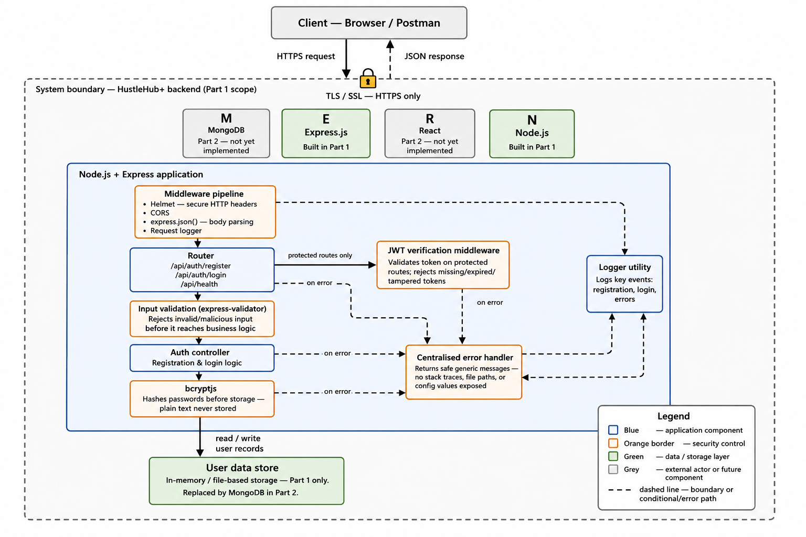

# HustleHub+ — Backend (Part 1: Secure Foundations)

HustleHub+ is a secure freelance marketplace platform. Freelancers advertise
services, clients browse and book them, and the platform records the
resulting transactions, tracks freelancer income, and estimates tax
obligations. Because the system handles credentials, transaction records,
and income data, security was treated as a core requirement from the first
line of code, not something added afterward.

This repository currently covers **Part 1** of the INSY7314 / APDS7311 POE:
a secure Express API supporting user registration and authenticated login.

**Module:** INSY7314/w (Information Systems 3D) & APDS7311/w (Application
Development Security)
**Group:** Null Devs
**Group Leader:** Muaaz (ST10443760)

---

## 1. System Overview

HustleHub+ has three intended user types, though only the foundational
authentication layer is built in Part 1:

- **Clients** — browse available gigs and book freelancer services (Part 2)
- **Freelancers** — list gigs, manage bookings, and track income (Part 2)
- **Admins** — oversee the platform (later phase)

Part 1 focuses purely on getting users into the system safely: registering
an account, logging in, and proving who they are on every subsequent
request via a signed token — before any marketplace functionality exists on
top of it.

## 2. Architecture

The system follows a MERN-oriented architecture. Part 1 implements the
**Express/Node** backend only; **React** (frontend) and **MongoDB**
(database) are introduced in Part 2, replacing the in-memory storage used
here.



*(Diagram shows the client communicating over HTTPS with the Express
backend, the security middleware layer requests pass through before
reaching application logic, and the boundary of what is considered "our
system" versus external actors.)*

The request flow through the backend is:

```
Client (browser / Postman)
      │  HTTPS
      ▼
Middleware pipeline (Helmet, CORS, body parsing, request logging)
      │
      ▼
Router  ──────────────►  JWT verification middleware (protected routes only)
      │
      ▼
Auth controller (register / login logic)
      │
      ▼
bcryptjs (password hashing)  +  input validation
      │
      ▼
In-memory user store
```

Errors raised at any stage are caught by a single centralised error handler
registered last in the middleware chain, so every error response is
formatted consistently and never leaks internal details.

## 3. Project Structure

```
src/
  app.js                     # Express app, middleware pipeline, route mounting
  server.js                  # entry point - starts the HTTPS server
  routes/
    authRoutes.js            # /api/auth/register, /login, /me
  controllers/
    authController.js        # register/login business logic
  models/
    userModel.js             # in-memory user storage (Part 1 only)
  middleware/
    authMiddleware.js        # JWT verification ("protect") + role check
    errorHandler.js          # centralised error handling
    validators.js            # input validation rules (express-validator)
  utils/
    logger.js                 # shared logging utility
    generateToken.js         # JWT signing helper
certs/                        # local self-signed SSL certificate (see certs/README.md)
postman/                      # Postman collection for API testing
```

## 4. Getting Started

```bash
npm install
cp .env.example .env      # then set your own JWT_SECRET inside .env
npm run dev
```

The API runs at `https://localhost:5000`. Because the SSL certificate is
self-signed (see `certs/README.md` for why and how to regenerate it), your
browser and Postman will warn that the connection isn't trusted — that
warning is expected for local development. In Postman, disable "SSL
certificate verification" under Settings → General.

**Health check:** `GET /api/health`

## 5. Authentication & Password Security

Registration (`POST /api/auth/register`) accepts a name, email, and
password. Before anything is stored, the password is hashed using
**bcryptjs** with a salt round factor of 10 — the plain-text password is
never written to storage, logged, or included in any API response. Login
(`POST /api/auth/login`) re-hashes the submitted password using the same
algorithm and compares it against the stored hash; the two are never
compared as plain text.

We chose `bcryptjs` (a pure JavaScript implementation) over the native
`bcrypt` package specifically to avoid `bcrypt`'s native-compilation
dependency chain, which pulled in several high/critical npm audit
vulnerabilities in build tooling unrelated to our own code. `bcryptjs`
exposes an identical API (`hash()`, `compare()`) with no native build step,
which also simplifies setup for every team member regardless of OS.

Duplicate registrations are rejected with a generic `409` response, and
failed logins (wrong password or unknown email) both return the same
generic `"Invalid email or password"` message and status code — this is
deliberate: distinguishing between "wrong password" and "no such account"
would let an attacker enumerate valid registered emails.

## 6. Token-Based Authentication (JWT)

On successful registration or login, the API issues a JSON Web Token
containing only the user's `id` and `role` in its payload — never the
password hash or other sensitive fields, since a JWT payload is signed but
not encrypted and can be decoded by anyone holding the token.

Protected routes (currently `GET /api/auth/me`) are wrapped in a `protect`
middleware that:

1. Reads the token from the `Authorization: Bearer <token>` header
2. Verifies its signature against `JWT_SECRET`
3. Confirms the user it refers to still exists
4. Attaches the authenticated user to `req.user` for the controller to use

Missing, expired, or tampered tokens all return the same generic `401`
response. The JWT secret is read from an environment variable
(`process.env.JWT_SECRET`) and is never hard-coded in source or committed
to the repository.

## 7. HTTPS

The API is served over HTTPS using a locally generated, self-signed SSL
certificate (`certs/cert.pem`, `certs/key.pem`). `server.js` reads these
files and starts an `https` server rather than plain `http`. See
`certs/README.md` for exact instructions to regenerate the certificate,
since certificate/key files are excluded from git via `.gitignore` and must
be generated locally by anyone cloning the repository. HTTPS matters even
in local development because it's the same code path that will run in
production — testing over plain HTTP would hide any issues specific to a
TLS connection.

## 8. Input Validation & Error Handling

Every field accepted by `/register` and `/login` is validated using
`express-validator` before it reaches the controller: names and emails are
trimmed and format-checked, emails are normalised, and passwords must meet
a minimum length and complexity rule. Invalid input is rejected with a
`400` response listing the specific validation failures, without ever
executing any business logic against unvalidated data.

All errors — validation failures, authentication failures, or unexpected
exceptions — pass through a single centralised error handler
(`middleware/errorHandler.js`). This handler:

- Logs the full error detail (including stack trace) to the server console only
- Returns a generic, safe message to the client for any non-operational
  (unexpected) error
- Never includes a stack trace, file path, or configuration value in any
  client-facing response

## 9. Logging

A shared logging utility (`utils/logger.js`) is used throughout the
codebase instead of raw `console.log`, so log output stays consistent and
timestamped. Key events are logged with an `event()` helper, currently
covering registration, successful login, and failed login attempts —
laying the groundwork for the more comprehensive logging required in
Part 3.

## 10. Testing

A Postman collection (`postman/HustleHub_Part1_Auth.postman_collection.json`)
covers both valid and invalid scenarios:

- Health check
- Successful registration (+ automated checks that a token is returned and
  no password hash is leaked)
- Duplicate email registration (expects `409`)
- Invalid registration input (expects `400`)
- Successful login
- Login with wrong password (expects `401`, generic message)
- Login with unknown email (expects `401`, same generic message)
- Protected route with no token (expects `401`)
- Protected route with an invalid/tampered token (expects `401`)
- Protected route with a valid token (expects `200` and the authenticated user)

To run it: import the collection into Postman, disable SSL verification,
start the server (`npm run dev`), and run the collection — or run it
headlessly via Newman:

```bash
npm install -g newman
newman run postman/HustleHub_Part1_Auth.postman_collection.json --insecure
```

## 11. Demonstration Video

`<link to be added>`

## 12. Security Review Summary

| Concern | How it's addressed |
|---|---|
| Plain-text password storage | Never stored — hashed with bcryptjs before persisting |
| Credential stuffing / enumeration | Identical generic error for wrong password vs unknown email |
| Unauthorised access to protected routes | JWT required and verified on every protected request |
| Token tampering | Signature verification via `JWT_SECRET`; invalid signatures rejected |
| Injection / malformed input | express-validator rejects invalid input before it reaches controllers |
| Information leakage via errors | Centralised error handler strips stack traces/internals from all client responses |
| Data interception in transit | API served over HTTPS, even in local development |