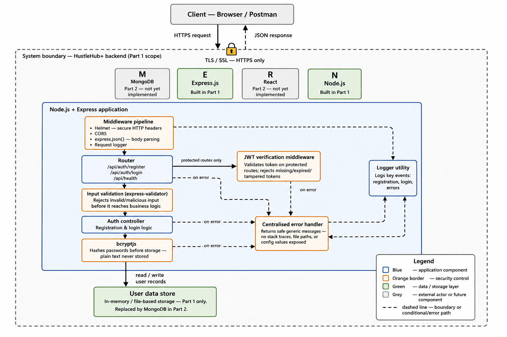
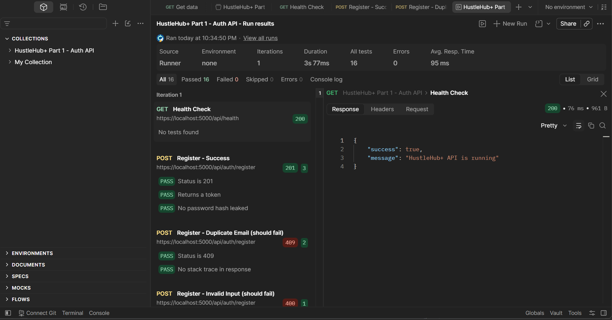
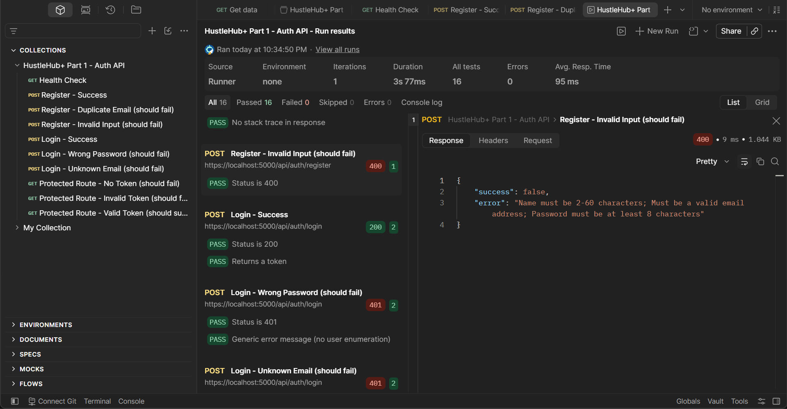
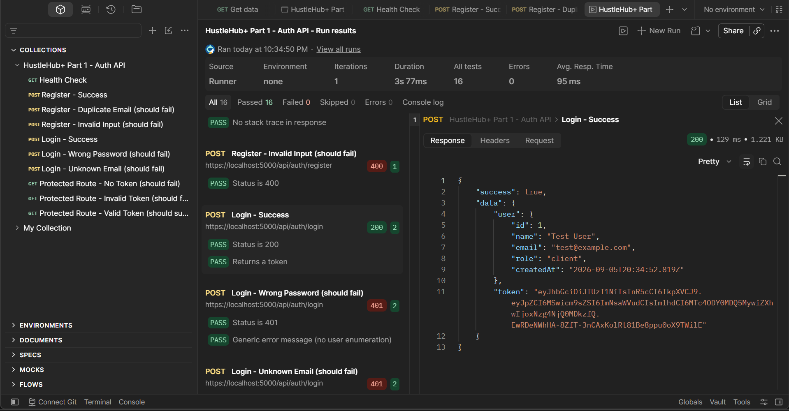

# HustleHub+ — Backend (Part 1: Secure Foundations)

HustleHub+ is a secure freelance marketplace platform. Freelancers advertise
services, clients browse and book them, and the platform records the
resulting transactions, tracks freelancer income, and estimates tax
obligations. Because the system handles credentials, transaction records,
and income data, security was treated as a core requirement from the first
line of code, not something added afterward.

This repository currently covers **Part 1** of the INSY7314 / APDS7311 POE:
a secure Express API supporting user registration and authenticated login.

**Module:** INSY7314/w (Information Systems 3D) & APDS7311/w (Application
Development Security)
**Group:** Null Devs
**Group Leader:** Muaaz (ST10443760)

---

## 1. System Overview

HustleHub+ has three intended user types, though only the foundational
authentication layer is built in Part 1:

- **Clients** — browse available gigs and book freelancer services (Part 2)
- **Freelancers** — list gigs, manage bookings, and track income (Part 2)
- **Admins** — oversee the platform (later phase)

Part 1 focuses purely on getting users into the system safely: registering
an account, logging in, and proving who they are on every subsequent
request via a signed token — before any marketplace functionality exists on
top of it.

## 2. Architecture

The system follows a MERN architecture: a **React** frontend, an
**Express/Node** backend and a **MongoDB** database (via Mongoose). Part 1
kept users in memory; Part 2 replaces that with MongoDB, so accounts and all
marketplace data now persist across server restarts.



*(Diagram shows the client communicating over HTTPS with the Express
backend, the security middleware layer requests pass through before
reaching application logic, and the boundary of what is considered "our
system" versus external actors.)*

The request flow through the backend is:

```
Client (browser / Postman)
      │  HTTPS
      ▼
Middleware pipeline (Helmet, CORS, body parsing, request logging)
      │
      ▼
Router  ──────────────►  JWT verification middleware (protected routes only)
      │
      ▼
Auth controller (register / login logic)
      │
      ▼
bcryptjs (password hashing)  +  input validation
      │
      ▼
MongoDB (Mongoose models)
```

Errors raised at any stage are caught by a single centralised error handler
registered last in the middleware chain, so every error response is
formatted consistently and never leaks internal details.

## 3. Project Structure

```
api/                           # Express backend
  src/
    app.js                     # Express app, middleware pipeline, route mounting
    server.js                  # entry point - starts the HTTPS server
    routes/
      authRoutes.js            # /api/auth/register, /login, /me
      adminRoutes.js           # /api/admin/* (admin role only)
      gigRoutes.js             # /api/gigs (browse, create, update, delete)
      bookingRoutes.js         # /api/bookings (book a gig, my bookings, one booking)
      transactionRoutes.js     # /api/transactions/mine
      incomeRoutes.js          # /api/income (freelancer earnings)
    controllers/
      authController.js        # register/login business logic
      adminController.js       # admin-only actions (users, all transactions)
      gigController.js         # gig listing, search and owner-only changes
      bookingController.js     # booking + transaction in one database transaction
      transactionController.js # each user's own transactions
      incomeController.js      # income aggregation over completed transactions
    config/
      db.js                    # MongoDB connection (Mongoose)
    models/
      User.js                  # users (password hash never selected by default)
      Gig.js                   # gig listings owned by a freelancer
      Booking.js               # a client's booking of a gig
      Transaction.js           # payment record created for every booking
    middleware/
      authMiddleware.js        # JWT verification ("protect") + role check ("requireRole")
      ownership.js             # "requireOwnership" - users can only touch their own records
      validateObjectId.js      # rejects malformed :id params with a 400
      errorHandler.js          # centralised error handling
      validators.js            # input validation rules (express-validator)
      gigValidators.js         # gig body + list query rules, HTML escaping
      bookingValidators.js     # booking body: gigId only
    utils/
      logger.js                # shared logging utility
      generateToken.js         # JWT signing helper
      password.js              # bcryptjs hashing (shared salt rounds)
      escapeRegex.js           # makes search text safe to use in a regex
      money.js                 # rounds money to 2 decimals
  scripts/
    seedAdmin.js               # creates the admin account (npm run seed:admin)
    cleanTestData.js           # removes test users (npm run clean:test)
  certs/                       # local self-signed SSL certificate (see api/certs/README.md)
  postman/                     # Postman collection for API testing
client/                        # React frontend (Vite)
docs/                          # architecture diagram and screenshots
```

## 4. Getting Started

The backend and frontend are separate projects, so run each one in its own
terminal.

**Backend (`api/`)**

```bash
cd api
npm install
cp .env.example .env      # then set MONGO_URI and JWT_SECRET inside .env
npm run dev
```

The API needs a MongoDB database. Set `MONGO_URI` in `api/.env` to either a
local instance (`mongodb://localhost:27017/hustlehub`) or a MongoDB Atlas
connection string. The real value lives only in `.env`, which is never
committed. The server connects to the database before it starts listening,
and exits with a safe error message (never the URI) if it can't connect.

If an Atlas `mongodb+srv://` string fails with `querySrv ECONNREFUSED`,
Node can't resolve the SRV record on your network. Use the standard
`mongodb://host1,host2,host3/...` string from Atlas (Connect → Drivers)
instead.

**Creating the admin account**

Admins can't sign up through `/api/auth/register`, so the admin account is
created by a seed script. Set `ADMIN_EMAIL`, `ADMIN_NAME` and
`ADMIN_PASSWORD` (at least 12 characters) in `api/.env`, then:

```bash
cd api
npm run seed:admin
```

The script is safe to run again: if an account with that email already
exists it says so and changes nothing. It never logs the password or the
database URI.

**Clearing test data**

Newman runs and manual testing create throwaway users
(`test-...@example.com`, `role-...@example.com`). To remove only those users
and the gigs, bookings and transactions that belong to them:

```bash
cd api
npm run clean:test
```

It prints how much it removed, never deletes an admin, and refuses to run
when `NODE_ENV` is `production`.

**Frontend (`client/`)**

```bash
cd client
npm install
npm run dev
```

The frontend runs at `http://localhost:5173`. In development, Vite proxies
every `/api` request to the backend at `https://localhost:5000`, so start the
backend first. The proxy skips certificate checks (`secure: false`) only
because the local cert is self-signed; this setting is dev-only.

The API runs at `https://localhost:5000`. Because the SSL certificate is
self-signed (see `api/certs/README.md` for why and how to regenerate it), your
browser and Postman will warn that the connection isn't trusted — that
warning is expected for local development. In Postman, disable "SSL
certificate verification" under Settings → General.

**Health check:** `GET /api/health`

## 5. Authentication & Password Security

Registration (`POST /api/auth/register`) accepts a name, email, and
password. Before anything is stored, the password is hashed using
**bcryptjs** with a salt round factor of 10 — the plain-text password is
never written to storage, logged, or included in any API response. Login
(`POST /api/auth/login`) re-hashes the submitted password using the same
algorithm and compares it against the stored hash; the two are never
compared as plain text.

We chose `bcryptjs` (a pure JavaScript implementation) over the native
`bcrypt` package specifically to avoid `bcrypt`'s native-compilation
dependency chain, which pulled in several high/critical npm audit
vulnerabilities in build tooling unrelated to our own code. `bcryptjs`
exposes an identical API (`hash()`, `compare()`) with no native build step,
which also simplifies setup for every team member regardless of OS.

Duplicate registrations are rejected with a generic `409` response, and
failed logins (wrong password or unknown email) both return the same
generic `"Invalid email or password"` message and status code — this is
deliberate: distinguishing between "wrong password" and "no such account"
would let an attacker enumerate valid registered emails.

## 6. Token-Based Authentication (JWT)

On successful registration or login, the API issues a JSON Web Token
containing only the user's `id` and `role` in its payload — never the
password hash or other sensitive fields, since a JWT payload is signed but
not encrypted and can be decoded by anyone holding the token.

Protected routes (currently `GET /api/auth/me`) are wrapped in a `protect`
middleware that:

1. Reads the token from the `Authorization: Bearer <token>` header
2. Verifies its signature against `JWT_SECRET`
3. Confirms the user it refers to still exists
4. Attaches the authenticated user to `req.user` for the controller to use

Missing, expired, or tampered tokens all return the same generic `401`
response. The JWT secret is read from an environment variable
(`process.env.JWT_SECRET`) and is never hard-coded in source or committed
to the repository.

### Roles and access control

Every user has exactly one role. It's stored on the user record in MongoDB,
and `protect` reads it from the database on each request rather than
trusting the token, so a role change takes effect immediately.

| Role | How you get it | What it can do |
|---|---|---|
| `client` | Default at registration | Browse gigs, book gigs, view their own bookings and transactions |
| `freelancer` | Choose it at registration | Create, edit and delete their **own** gigs, view bookings on their gigs, view their income |
| `admin` | Only via `npm run seed:admin` | List all users, view all transactions, remove any gig |

Registration only accepts `client` or `freelancer`. Sending
`"role": "admin"` is rejected with a `400`, so nobody can make themselves an
admin through the API.

Routes are restricted with `requireRole(...)`. A user with the wrong role
gets a generic `403` that doesn't say which role would have been allowed, and
the attempt is logged (user id, role, method and path). All `/api/admin`
routes require both a valid token and the admin role.

**Ownership rule.** Being the right role isn't enough to change a record: you
also have to own it. `requireOwnership` loads the record by its id, returns
`404` if it doesn't exist and `403` if its owner isn't the logged-in user.
The owner is always compared against the user from the verified token and
database lookup, never against an id sent in the request body or query
string. Admins only bypass this on routes that explicitly allow it. Malformed
ids are rejected with a `400` by `validateObjectId` before they reach the
database.

### API endpoints

All routes are under `https://localhost:5000`. "Logged in" means a valid
`Authorization: Bearer <token>` header.

| Method | Path | Who can call it | Notes |
|---|---|---|---|
| GET | `/api/health` | Anyone | Health check |
| POST | `/api/auth/register` | Anyone | `role` may be `client` (default) or `freelancer`, never `admin` |
| POST | `/api/auth/login` | Anyone | Same generic error for wrong password and unknown email |
| GET | `/api/auth/me` | Logged in | The current user |
| GET | `/api/admin/users` | Admin | All users, newest first, no password hashes |
| GET | `/api/admin/transactions` | Admin | All transactions, newest first. Query: `page`, `limit` (max 50) |
| GET | `/api/gigs` | Logged in | Active gigs, newest first. Query: `page`, `limit` (max 50), `category`, `q`, `minPrice`, `maxPrice` |
| GET | `/api/gigs/mine` | Freelancer | Your own gigs, including inactive ones |
| GET | `/api/gigs/:id` | Logged in | One gig. Inactive gigs are only visible to their owner (404 for everyone else) |
| POST | `/api/gigs` | Freelancer | Creates a gig owned by you |
| PUT | `/api/gigs/:id` | Freelancer, **owner only** | Update `title`, `description`, `price`, `category`, `deliveryDays`, `isActive` |
| DELETE | `/api/gigs/:id` | Freelancer, **owner only** | Deletes the gig, or deactivates it if it already has bookings |
| POST | `/api/bookings` | Client | Body is `{ "gigId": "..." }` only. Creates the booking and its transaction, returns a simulated payment confirmation |
| GET | `/api/bookings/mine` | Client, Freelancer | Clients: their bookings. Freelancers: bookings on their gigs. Newest first |
| GET | `/api/bookings/:id` | The booking's client or freelancer | Anyone else gets `403` |
| GET | `/api/transactions/mine` | Client, Freelancer | Clients: what they paid. Freelancers: what they were paid |
| GET | `/api/income` | Freelancer | `{ totalEarned, bookingCount, items }` from completed transactions |

**Gig rules**

- The owner of a gig is always the logged-in freelancer (`req.user.id`).
  Sending `freelancer`, `isActive` or any other field that isn't allowed
  is rejected with a `400`, not silently ignored.
- Text fields (title, description, category) are trimmed, length-checked
  and HTML-escaped before they're saved, so markup can't run in a browser
  later. Price must be a number from 1 to 100000 (at most 2 decimals),
  delivery days a whole number from 1 to 90, and category one of
  `design`, `writing`, `development`, `marketing`, `video`, `other`.
- Search (`q`) is plain text: regex characters are escaped, so `.*` only
  matches the literal text `.*`.
- Updating or deleting someone else's gig returns `403` and is logged.
  A gig with bookings is deactivated instead of deleted so booking and
  transaction history keeps a valid reference.

### Booking and transaction flow

1. **The client books a gig.** `POST /api/bookings` takes only a `gigId`.
   Any other field (price, freelancer, client, status) is rejected with a
   `400`. The client is the logged-in user, and the gig must exist and be
   active, otherwise the response is `404`.
2. **The booking is created.** The freelancer and the price come from the
   gig in the database, never from the request. The booking stores a
   snapshot of the gig's title and price, so if the freelancer edits the
   gig later, existing bookings keep what was actually booked.
3. **The transaction is created in the same database transaction.** The
   booking and its transaction record are written together using a MongoDB
   transaction (a Mongoose session with `withTransaction`). If anything
   fails part-way, neither is saved, so a booking can never exist without
   its transaction. Each booking has exactly one transaction (enforced by a
   unique index). Payment is simulated: the transaction is marked
   `completed`, gets a unique reference such as `TXN-20261009-9F3A1C2B7D4E`,
   and the response includes a payment confirmation with that reference.
4. **Income is computed from completed transactions.** `GET /api/income`
   adds up the logged-in freelancer's transactions with status `completed`
   (refunded ones are left out) and lists each one with its booking, gig
   title, amount, date and reference.

Money is stored as a plain number rounded to 2 decimal places, and totals
are rounded the same way, so amounts like 19.99 add up exactly. Booking
creation, transaction creation and failed booking attempts are all logged.

## 7. HTTPS

The API is served over HTTPS using a locally generated, self-signed SSL
certificate (`api/certs/cert.pem`, `api/certs/key.pem`). `server.js` reads these
files and starts an `https` server rather than plain `http`. See
`api/certs/README.md` for exact instructions to regenerate the certificate,
since certificate/key files are excluded from git via `.gitignore` and must
be generated locally by anyone cloning the repository. HTTPS matters even
in local development because it's the same code path that will run in
production — testing over plain HTTP would hide any issues specific to a
TLS connection.

## 8. Input Validation & Error Handling

Every field accepted by `/register` and `/login` is validated using
`express-validator` before it reaches the controller: names and emails are
trimmed and format-checked, emails are normalised, and passwords must meet
a minimum length and complexity rule. Invalid input is rejected with a
`400` response listing the specific validation failures, without ever
executing any business logic against unvalidated data.

All errors — validation failures, authentication failures, or unexpected
exceptions — pass through a single centralised error handler
(`middleware/errorHandler.js`). This handler:

- Logs the full error detail (including stack trace) to the server console only
- Returns a generic, safe message to the client for any non-operational
  (unexpected) error
- Never includes a stack trace, file path, or configuration value in any
  client-facing response

## 9. Logging

A shared logging utility (`utils/logger.js`) is used throughout the
codebase instead of raw `console.log`, so log output stays consistent and
timestamped. Key events are logged with an `event()` helper, currently
covering registration, successful login, and failed login attempts —
laying the groundwork for the more comprehensive logging required in
Part 3.

## 10. Testing

A Postman collection (`api/postman/HustleHub_Part1_Auth.postman_collection.json`)
covers both valid and invalid scenarios:

- Health check
- Successful registration (+ automated checks that a token is returned and
  no password hash is leaked)
- Duplicate email registration (expects `409`)
- Invalid registration input (expects `400`)
- Successful login
- Login with wrong password (expects `401`, generic message)
- Login with unknown email (expects `401`, same generic message)
- Protected route with no token (expects `401`)
- Protected route with an invalid/tampered token (expects `401`)
- Protected route with a valid token (expects `200` and the authenticated user)

An **RBAC** folder checks access control on `/api/admin/users`:

- No token (expects `401`)
- Client token (expects `403`, generic message)
- Freelancer token (expects `403`, generic message)
- Registering with `"role": "admin"` (expects `400`, no token issued)
- Admin login and admin token (expects `200`, no password hashes, newest
  first). These two only run when admin credentials are supplied and are
  skipped cleanly otherwise.

A **Gigs** folder registers two fresh freelancers and a fresh client, then
checks:

- Freelancer creates a gig (`201`, owner is the token's user); client
  (`403`) and no token (`401`) can't
- Validation: negative price, empty title, and an unknown `freelancer` field
  in the body (all `400`)
- Browsing as a client (`200`, freelancer shown by name only, no emails or
  password hashes), regex characters in `q` treated as plain text
- Get by id (`200`), malformed id (`400`), unknown id (`404`)
- `/api/gigs/mine` returns only the caller's gigs
- Owner updates (`200`); another freelancer updating or deleting, and a
  client updating, are all `403`
- Owner deletes (`200`), after which the gig returns `404`

A **Bookings** folder registers a fresh client and two fresh freelancers,
then checks:

- The client books a gig (`201`): the price matches the gig, the freelancer
  and client come from the gig and the token, and the response includes the
  transaction and a payment confirmation with the same reference
- Sending `price`, `freelancer` or `status` in the body (`400`), a
  freelancer trying to book (`403`), no token (`401`)
- Malformed `gigId` (`400`), unknown `gigId` (`404`), inactive gig (`404`)
- `/api/bookings/mine` and `/api/transactions/mine` show the booking to
  the client and the gig's freelancer, but not to the other freelancer
- `GET /api/bookings/:id` works for both parties and is `403` for the
  other freelancer
- After the freelancer raises the gig price, the booking still shows the
  price it was booked at

An **Income** folder then checks that the gig's freelancer has
`totalEarned` equal to the booked price with one item, the other freelancer
has `0` and an empty list, a client gets `403` on `/api/income` and on
`/api/admin/transactions`, and (only when admin credentials are supplied)
the admin can list all transactions.

Every run registers users with a fresh `test-...@example.com` email, so the
collection can be run repeatedly against the same database. Use
`npm run clean:test` to clear them out afterwards (it also removes
their gigs, bookings and transactions).

To run it: import the collection into Postman, disable SSL verification,
start the server (`npm run dev` inside `api/`), and run the collection — or run it
headlessly via Newman:

```bash
npm install -g newman
newman run api/postman/HustleHub_Part1_Auth.postman_collection.json --insecure
```

To include the admin tests, pass the seeded admin's credentials as
variables (they're never stored in the collection):

```bash
newman run api/postman/HustleHub_Part1_Auth.postman_collection.json --insecure   --env-var admin_email=<ADMIN_EMAIL> --env-var admin_password=<ADMIN_PASSWORD>
```

## 11. Demonstration Video

https://youtu.be/qTK6iV_0lmI

## 12. Security Review Summary

| Concern | How it's addressed |
|---|---|
| Plain-text password storage | Never stored — hashed with bcryptjs before persisting |
| Credential stuffing / enumeration | Identical generic error for wrong password vs unknown email |
| Unauthorised access to protected routes | JWT required and verified on every protected request |
| Token tampering | Signature verification via `JWT_SECRET`; invalid signatures rejected |
| Injection / malformed input | express-validator rejects invalid input before it reaches controllers |
| Information leakage via errors | Centralised error handler strips stack traces/internals from all client responses |
| Data interception in transit | API served over HTTPS, even in local development |

## 13. API Testing Screenshots

Screenshots below show the Postman collection run confirming both successful
and invalid/error scenarios, matching the automated tests in
`api/postman/HustleHub_Part1_Auth.postman_collection.json`.

| Scenario | Screenshot |
|---|---|
| Health check | `docs/screenshots/01-health-check.png` |
| Successful registration (token issued, no password hash leaked) | `docs/screenshots/02-register-success.png` |
| Duplicate email registration rejected | `docs/screenshots/03-register-duplicate.png` |
| Invalid registration input rejected | `docs/screenshots/04-register-invalid.png` |
| Successful login (token issued) | `docs/screenshots/05-login-success.png` |
| Login with wrong password rejected | `docs/screenshots/06-login-wrong-password.png` |
| Protected route rejected with no token | `docs/screenshots/07-protected-no-token.png` |
| Protected route succeeds with valid token | `docs/screenshots/08-protected-valid-token.png` |








