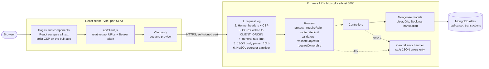
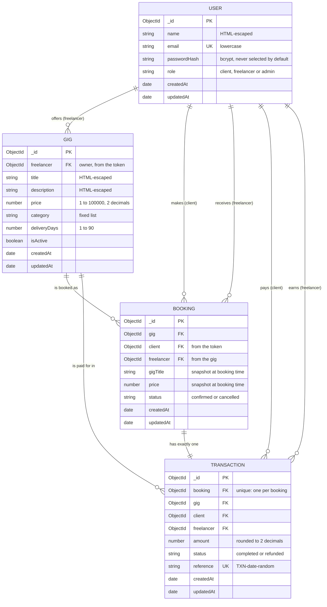
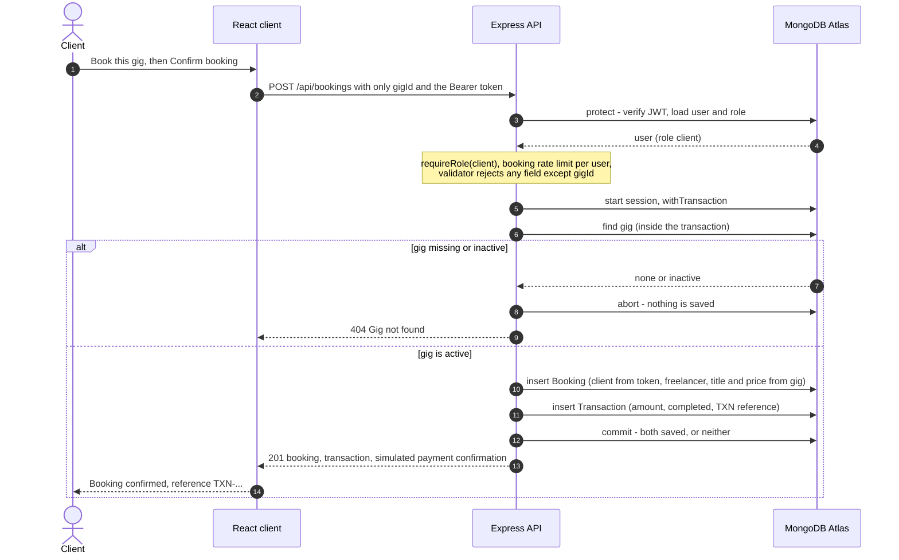
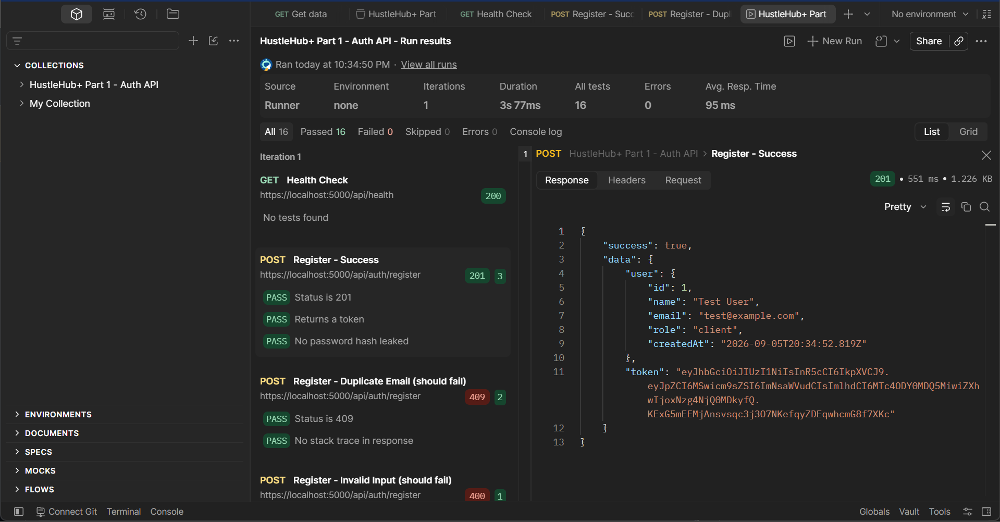
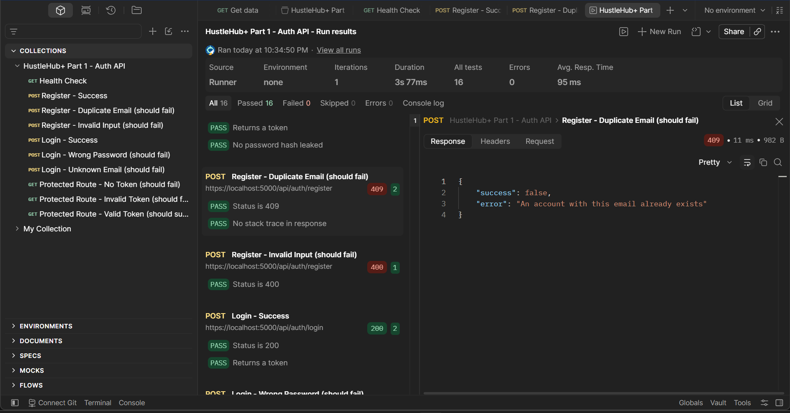
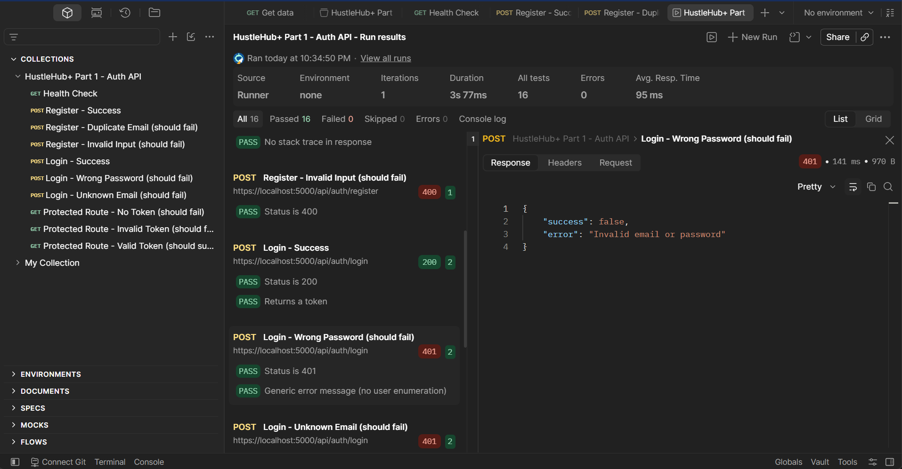
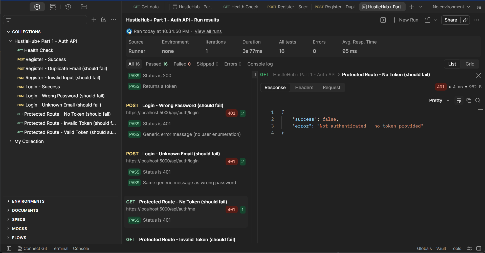
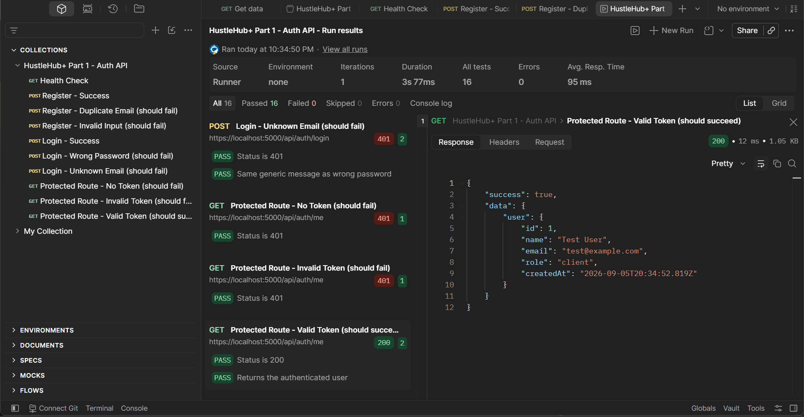

# HustleHub+

HustleHub+ is a secure freelance marketplace platform. Freelancers advertise
services, clients browse and book them, and the platform records the
resulting transactions, tracks freelancer income, and estimates tax
obligations. Because the system handles credentials, transaction records,
and income data, security was treated as a core requirement from the first
line of code, not something added afterward.

This repository is **Part 2 (Secure Stack)** of the INSY7314 / APDS7311 POE:
a full MERN application - a React client, an Express API and MongoDB - with
gig management, bookings, simulated payments, transaction records, income
tracking and an admin area, built on the secure foundations from Part 1.

**Module:** INSY7314/w (Information Systems 3D) & APDS7311/w (Application
Development Security)
**Group:** Null Devs
**Group Leader:** Muaaz (ST10443760)

---

## 1. System Overview

HustleHub+ has three user types:

- **Clients** browse active gigs, book them (with a simulated payment) and
  see their bookings and transactions.
- **Freelancers** create and manage their own gigs, see the bookings on
  them, and track their income.
- **Admins** (created by a seed script, never through sign-up) see every
  user and transaction and can remove any gig.

Every booking creates a transaction record linked to both the client and the
freelancer, in the same database transaction. Part 1 delivered the secure
authentication layer; Part 2 adds the marketplace on top of it, with
security enforced on every request by the API (the client's checks are
only for convenience).

## 2. Architecture

The system follows a MERN architecture: a **React** frontend, an
**Express/Node** backend and a **MongoDB** database (via Mongoose). Part 1
kept users in memory; Part 2 replaces that with MongoDB, so accounts and all
marketplace data now persist across server restarts.


```mermaid
flowchart LR
    user(["Browser"])

    subgraph client["React client - Vite, port 5173"]
        ui["Pages and components<br/>React escapes all text<br/>strict CSP on the built app"]
        apiClient["api/client.js<br/>relative /api URLs + Bearer token"]
        proxy["Vite proxy<br/>dev and preview"]
    end

    subgraph api["Express API - https://localhost:5000"]
        direction TB
        pipeline["1. request log<br/>2. Helmet headers + CSP<br/>3. CORS locked to CLIENT_ORIGIN<br/>4. general rate limit<br/>5. JSON body parser, 10kb<br/>6. NoSQL operator sanitiser"]
        routes["Routers<br/>protect - requireRole - route rate limit<br/>validators - validateObjectId - requireOwnership"]
        controllers["Controllers"]
        models["Mongoose models<br/>User, Gig, Booking, Transaction"]
        errors["Central error handler<br/>safe JSON errors only"]
        pipeline --> routes --> controllers --> models
        routes -. "4xx" .-> errors
        controllers -. "errors" .-> errors
    end

    db[("MongoDB Atlas<br/>replica set, transactions")]

    user --> ui --> apiClient --> proxy
    proxy -- "HTTPS, self-signed cert" --> pipeline
    models --> db
```

Every request passes through the same middleware pipeline, in this order,
before any route runs: a request log line, Helmet's security headers, CORS
(locked to `CLIENT_ORIGIN`), the general rate limit, the JSON body parser
(10kb limit) and the NoSQL operator sanitiser. Each router then adds its own
checks - `protect` (JWT + user loaded from the database), `requireRole`,
route-specific rate limits, validators, `validateObjectId` and
`requireOwnership` - before the controller talks to MongoDB through Mongoose.

> `docs/architecture-diagram.png` is the Part 1 diagram (API only). The
> Mermaid diagrams in this README are the current ones.

Errors raised at any stage are caught by a single centralised error handler
registered last in the middleware chain, so every error response is
formatted consistently and never leaks internal details.

### Data model


```mermaid
erDiagram
    USER ||--o{ GIG : "offers (freelancer)"
    USER ||--o{ BOOKING : "makes (client)"
    USER ||--o{ BOOKING : "receives (freelancer)"
    GIG ||--o{ BOOKING : "is booked as"
    BOOKING ||--|| TRANSACTION : "has exactly one"
    USER ||--o{ TRANSACTION : "pays (client)"
    USER ||--o{ TRANSACTION : "earns (freelancer)"
    GIG ||--o{ TRANSACTION : "is paid for in"

    USER {
        ObjectId _id PK
        string name "HTML-escaped"
        string email UK "lowercase"
        string passwordHash "bcrypt, never selected by default"
        string role "client, freelancer or admin"
        date createdAt
        date updatedAt
    }
    GIG {
        ObjectId _id PK
        ObjectId freelancer FK "owner, from the token"
        string title "HTML-escaped"
        string description "HTML-escaped"
        number price "1 to 100000, 2 decimals"
        string category "fixed list"
        number deliveryDays "1 to 90"
        boolean isActive
        date createdAt
        date updatedAt
    }
    BOOKING {
        ObjectId _id PK
        ObjectId gig FK
        ObjectId client FK "from the token"
        ObjectId freelancer FK "from the gig"
        string gigTitle "snapshot at booking time"
        number price "snapshot at booking time"
        string status "confirmed or cancelled"
        date createdAt
        date updatedAt
    }
    TRANSACTION {
        ObjectId _id PK
        ObjectId booking FK "unique: one per booking"
        ObjectId gig FK
        ObjectId client FK
        ObjectId freelancer FK
        number amount "rounded to 2 decimals"
        string status "completed or refunded"
        string reference UK "TXN-date-random"
        date createdAt
        date updatedAt
    }
```

Every booking stores a snapshot of the gig's title and price, and has exactly
one transaction (a unique index on `transaction.booking`). The owner and
parties on every record come from the verified token and the database,
never from the request.

## 3. Project Structure

```
api/                           # Express backend
  src/
    app.js                     # Express app, middleware pipeline, route mounting
    server.js                  # entry point - starts the HTTPS server
    routes/
      authRoutes.js            # /api/auth/register, /login, /me
      adminRoutes.js           # /api/admin/* (admin role only)
      gigRoutes.js             # /api/gigs (browse, create, update, delete)
      bookingRoutes.js         # /api/bookings (book a gig, my bookings, one booking)
      transactionRoutes.js     # /api/transactions/mine
      incomeRoutes.js          # /api/income (freelancer earnings)
    controllers/
      authController.js        # register/login business logic
      adminController.js       # admin-only actions (users, all transactions)
      gigController.js         # gig listing, search and owner-only changes
      bookingController.js     # booking + transaction in one database transaction
      transactionController.js # each user's own transactions
      incomeController.js      # income aggregation over completed transactions
    config/
      db.js                    # MongoDB connection (Mongoose)
      security.js              # Helmet/CSP options, CORS locked to CLIENT_ORIGIN
      rateLimits.js            # rate limit numbers (strict defaults, no overrides in production)
    models/
      User.js                  # users (password hash never selected by default)
      Gig.js                   # gig listings owned by a freelancer
      Booking.js               # a client's booking of a gig
      Transaction.js           # payment record created for every booking
    middleware/
      authMiddleware.js        # JWT verification ("protect") + role check ("requireRole")
      ownership.js             # "requireOwnership" - users can only touch their own records
      validateObjectId.js      # rejects malformed :id params with a 400
      errorHandler.js          # centralised error handling
      validators.js            # input validation rules (express-validator)
      gigValidators.js         # gig body + list query rules, HTML escaping
      bookingValidators.js     # booking body: gigId only
      sanitize.js              # strips $ and . keys from body, query and params
      rateLimiters.js          # login, register, booking and general limiters
    utils/
      logger.js                # shared logging utility
      generateToken.js         # JWT signing helper
      password.js              # bcryptjs hashing (shared salt rounds)
      escapeRegex.js           # makes search text safe to use in a regex
      money.js                 # rounds money to 2 decimals
      gigRemoval.js            # shared delete-or-deactivate rule for gigs
  scripts/
    seedAdmin.js               # creates the admin account (npm run seed:admin)
    cleanTestData.js           # removes test users and their data (npm run clean:test)
    startTest.js               # starts the API with relaxed rate limits (npm run start:test)
  certs/                       # local self-signed SSL certificate (see api/certs/README.md)
  postman/                     # Postman collection for API testing
client/                        # React frontend (Vite)
  index.html                   # page shell and title
  vite.config.js               # dev server + /api proxy to the HTTPS API
  src/
    main.jsx                   # router, auth provider, global styles
    App.jsx                    # routes, grouped by role
    api/                       # fetch wrapper (client.js) and one file per resource
    context/                   # AuthProvider, useAuth
    components/                # layout/nav, ProtectedRoute, form field, gig card, booking panel
    pages/                     # login, register, gigs, gig detail, my bookings, my transactions
    utils/                     # formatting, entity decoding, validation, token storage, hooks
    styles/                    # global.css (CSS variables, no UI library)
    test/                      # Vitest setup and a render helper (tests sit next to the code: *.test.jsx)
docs/                          # architecture diagram and screenshots
```

## 4. How to Run

Every command below was run, in this order, on a fresh clone of the
repository (Windows 11 with Git Bash and PowerShell, plus a Linux container
for the certificate and Node 22 checks).

### Requirements

| Tool | Version | Notes |
|---|---|---|
| Node.js | **22** (22.22+) or **24** (24.15+) | `engines` is set in both `package.json` files. The client's test tools (jsdom) don't support odd-numbered Node releases |
| npm | comes with Node | |
| MongoDB | Atlas cluster or a local replica set | Bookings use multi-document transactions, which need a replica set (every Atlas cluster is one) |
| OpenSSL | any recent | Only for the local HTTPS certificate. Preinstalled on macOS/Linux; on Windows it comes with Git for Windows |
| Newman | via `npx` | Only for the Postman tests |

The backend and frontend are separate projects; run each in its own terminal.

### Backend (`api/`)

```bash
cd api
npm ci                    # exact versions from package-lock.json
cp .env.example .env      # PowerShell: Copy-Item .env.example .env
```

Then edit `api/.env` (it is git-ignored and never committed):

| Variable | What to put there |
|---|---|
| `MONGO_URI` | Your MongoDB connection string. If an Atlas `mongodb+srv://` string fails with `querySrv ECONNREFUSED`, Node can't resolve the SRV record on your network - use the standard `mongodb://host1,host2,host3/...` string from Atlas (Connect → Drivers) instead |
| `JWT_SECRET` | A long random string |
| `JWT_EXPIRES_IN` | Token lifetime, default `1h` |
| `CLIENT_ORIGIN` | `http://localhost:5173` - the only browser origin the API accepts (exact origin, no trailing slash; required in production) |
| `ADMIN_EMAIL`, `ADMIN_NAME`, `ADMIN_PASSWORD` | The admin account the seed script creates (password at least 12 characters) |
| `PORT`, `NODE_ENV` | `5000` and `development` |
| `RATE_LIMIT_*_MAX` | Leave commented out. Local-testing overrides only, ignored in production |

Generate the local HTTPS certificate **before starting the API**, seed the
admin, then start the server:

```bash
npm run certs             # creates api/certs/key.pem and cert.pem (git-ignored)
npm run seed:admin        # creates the admin account; safe to run again
npm run dev               # https://localhost:5000 (nodemon)
```

- `npm run certs` works the same in Git Bash, PowerShell, macOS and Linux.
  To run OpenSSL by hand instead (and why the raw command fails in Git
  Bash), see [`api/certs/README.md`](api/certs/README.md).
- **If the certificate is missing**, the API still starts but on plain
  **HTTP** and logs a warning. The client proxy and both Postman collections
  expect HTTPS, so the client then gets `502` errors (Vite logs
  `EPROTO ... wrong version number`) and Newman fails. Run `npm run certs`
  and restart.
- The server connects to MongoDB before it starts listening and exits with a
  safe message (never the URI) if it can't.
- Check it: `curl -k https://localhost:5000/api/health`. Browsers and Postman
  warn about the self-signed certificate - that's expected locally (in
  Postman, turn off "SSL certificate verification" under Settings → General).
- Other API scripts: `npm start` (no nodemon), `npm run start:test` (relaxed
  rate limits for the main Newman run - see **Testing**), `npm run clean:test`
  (see below).

### Frontend (`client/`)

With the API running, in a second terminal:

```bash
cd client
npm ci
npm run dev               # http://localhost:5173
```

Open `http://localhost:5173`. Vite proxies every `/api` request to
`https://localhost:5000`, so the client only ever calls relative `/api/...`
URLs and no API host or port is hard-coded. The proxy skips certificate
checks (`secure: false`) only because the local certificate is self-signed;
this setting is dev-only.

### Built client (production build)

Stop the dev server first (preview uses the same port), keep the API running:

```bash
cd client
npm run build             # production build in client/dist/
npm run preview           # serves dist/ at http://localhost:5173 with the CSP headers and the /api proxy
```

Preview deliberately uses the same port as the dev server. Browsers send an
`Origin` header on POST requests, the proxy passes it on, and the API's CORS
only accepts `CLIENT_ORIGIN` (`http://localhost:5173`), so the built app has to
be served from that origin too.

### Clearing test data

Newman runs and manual testing create throwaway users
(`test-...@example.com`, `role-...@example.com`). To remove only those users
and the gigs, bookings and transactions that belong to them:

```bash
cd api
npm run clean:test
```

It prints how much it removed, never deletes an admin, and refuses to run
when `NODE_ENV` is `production`.

## 5. Using the App

**Screens by role**

| Role | Screens |
|---|---|
| Anyone | Home, Register (client or freelancer only), Log in |
| Client | Browse gigs (search, category, price range, pages), Gig detail with **Book this gig** and a simulated payment confirmation, My bookings, My transactions |
| Freelancer | Browse gigs, My gigs (New, Edit, Activate/Deactivate, Delete with confirmation), New/Edit gig form, Bookings on my gigs, Income (total, booking count, per-booking table), an **Edit** link on their own gig pages |
| Admin | Browse gigs, Users (name, email, role, joined), All transactions (paginated), **Delete as admin** on any gig page |

A logged-out visitor who opens a protected page is sent to Log in; a
logged-in user with the wrong role sees a "Not allowed" page. These are
conveniences only - the API enforces every rule itself.

Deleting a gig (owner or admin) shows the API's own message, because a gig
that already has bookings is deactivated instead of deleted.

**How the client handles API text.** The API HTML-escapes free text before
saving it (so `<b>` is stored as `&lt;b&gt;`). The client decodes exactly
those entities for display (`utils/text.js`) and React renders the result
as plain text. The edit gig form also decodes the stored text into its inputs
and sends back exactly what the freelancer typed, so the API escapes it once
and text never double-escapes (no `&amp;amp;`). Nothing is ever rendered as HTML: there is no
`dangerouslySetInnerHTML` and no HTML strings are built, so a gig titled
`` shows up as those literal characters.

**Session.** Only the JWT is stored, in `localStorage` (see the trade-off under
**Security**). On start-up the client checks it with `GET /api/auth/me`; if the
API later answers `401`, the token is cleared and the user is sent to the
login page. The client never logs tokens or request data.

The client's Content-Security-Policy is described under **Security → Client
Content-Security-Policy**, and its tests under **Testing → Frontend tests**.


## 5. Authentication & Password Security

Registration (`POST /api/auth/register`) accepts a name, email, and
password. Before anything is stored, the password is hashed using
**bcryptjs** with a salt round factor of 10 — the plain-text password is
never written to storage, logged, or included in any API response. Login
(`POST /api/auth/login`) re-hashes the submitted password using the same
algorithm and compares it against the stored hash; the two are never
compared as plain text.

We chose `bcryptjs` (a pure JavaScript implementation) over the native
`bcrypt` package specifically to avoid `bcrypt`'s native-compilation
dependency chain, which pulled in several high/critical npm audit
vulnerabilities in build tooling unrelated to our own code. `bcryptjs`
exposes an identical API (`hash()`, `compare()`) with no native build step,
which also simplifies setup for every team member regardless of OS.

Duplicate registrations are rejected with a generic `409` response, and
failed logins (wrong password or unknown email) both return the same
generic `"Invalid email or password"` message and status code — this is
deliberate: distinguishing between "wrong password" and "no such account"
would let an attacker enumerate valid registered emails.

## 6. Token-Based Authentication (JWT)

On successful registration or login, the API issues a JSON Web Token
containing only the user's `id` and `role` in its payload — never the
password hash or other sensitive fields, since a JWT payload is signed but
not encrypted and can be decoded by anyone holding the token.

Every route except the health check, register and login is wrapped in a
`protect` middleware that:

1. Reads the token from the `Authorization: Bearer <token>` header
2. Verifies its signature against `JWT_SECRET`
3. Loads the user from the database, confirming they still exist and
   taking their role from the database rather than the token
4. Attaches the authenticated user to `req.user` for the controller to use

Missing, expired, or tampered tokens all return the same generic `401`
response. The JWT secret is read from an environment variable
(`process.env.JWT_SECRET`) and is never hard-coded in source or committed
to the repository.

### Roles and access control

Every user has exactly one role. It's stored on the user record in MongoDB,
and `protect` reads it from the database on each request rather than
trusting the token, so a role change takes effect immediately.

| Role | How you get it | What it can do |
|---|---|---|
| `client` | Default at registration | Browse gigs, book gigs, view their own bookings and transactions |
| `freelancer` | Choose it at registration | Create, edit and delete their **own** gigs, view bookings on their gigs, view their income |
| `admin` | Only via `npm run seed:admin` | List all users, view all transactions, remove any gig |

Registration only accepts `client` or `freelancer`. Sending
`"role": "admin"` is rejected with a `400`, so nobody can make themselves an
admin through the API.

Routes are restricted with `requireRole(...)`. A user with the wrong role
gets a generic `403` that doesn't say which role would have been allowed, and
the attempt is logged (user id, role, method and path). All `/api/admin`
routes require both a valid token and the admin role.

**Ownership rule.** Being the right role isn't enough to change a record: you
also have to own it. `requireOwnership` loads the record by its id, returns
`404` if it doesn't exist and `403` if its owner isn't the logged-in user.
The owner is always compared against the user from the verified token and
database lookup, never against an id sent in the request body or query
string. Admins only bypass this on routes that explicitly allow it. Malformed
ids are rejected with a `400` by `validateObjectId` before they reach the
database.

### API endpoints

All routes are under `https://localhost:5000`. "Logged in" means a valid
`Authorization: Bearer <token>` header.

| Method | Path | Who can call it | Notes |
|---|---|---|---|
| GET | `/api/health` | Anyone | Health check |
| POST | `/api/auth/register` | Anyone | `role` may be `client` (default) or `freelancer`, never `admin`. Rate limited |
| POST | `/api/auth/login` | Anyone | Same generic error for wrong password and unknown email. Rate limited |
| GET | `/api/auth/me` | Logged in | The current user |
| GET | `/api/admin/users` | Admin | All users, newest first, no password hashes |
| GET | `/api/admin/transactions` | Admin | All transactions, newest first. Query: `page`, `limit` (max 50) |
| DELETE | `/api/admin/gigs/:id` | Admin | Removes any gig: deleted if it has no bookings, otherwise deactivated |
| GET | `/api/gigs` | Logged in | Active gigs, newest first. Query: `page`, `limit` (max 50), `category`, `q`, `minPrice`, `maxPrice` |
| GET | `/api/gigs/mine` | Freelancer | Your own gigs, including inactive ones |
| GET | `/api/gigs/:id` | Logged in | One gig. Inactive gigs are only visible to their owner (404 for everyone else) |
| POST | `/api/gigs` | Freelancer | Creates a gig owned by you |
| PUT | `/api/gigs/:id` | Freelancer, **owner only** | Update `title`, `description`, `price`, `category`, `deliveryDays`, `isActive` |
| DELETE | `/api/gigs/:id` | Freelancer, **owner only** | Deletes the gig, or deactivates it if it already has bookings |
| POST | `/api/bookings` | Client | Body is `{ "gigId": "..." }` only. Creates the booking and its transaction, returns a simulated payment confirmation. Rate limited per user |
| GET | `/api/bookings/mine` | Client, Freelancer | Clients: their bookings. Freelancers: bookings on their gigs. Newest first |
| GET | `/api/bookings/:id` | The booking's client or freelancer | Anyone else gets `403` |
| GET | `/api/transactions/mine` | Client, Freelancer | Clients: what they paid. Freelancers: what they were paid |
| GET | `/api/income` | Freelancer | `{ totalEarned, bookingCount, items }` from completed transactions |

**Gig rules**

- The owner of a gig is always the logged-in freelancer (`req.user.id`).
  Sending `freelancer`, `isActive` or any other field that isn't allowed
  is rejected with a `400`, not silently ignored.
- Text fields (title, description, category) are trimmed, length-checked
  and HTML-escaped before they're saved, so markup can't run in a browser
  later. Price must be a number from 1 to 100000 (at most 2 decimals),
  delivery days a whole number from 1 to 90, and category one of
  `design`, `writing`, `development`, `marketing`, `video`, `other`.
- Search (`q`) is plain text: regex characters are escaped, so `.*` only
  matches the literal text `.*`.
- Updating or deleting someone else's gig returns `403` and is logged.
  A gig with bookings is deactivated instead of deleted so booking and
  transaction history keeps a valid reference.

### Booking and transaction flow

1. **The client books a gig.** `POST /api/bookings` takes only a `gigId`.
   Any other field (price, freelancer, client, status) is rejected with a
   `400`. The client is the logged-in user, and the gig must exist and be
   active, otherwise the response is `404`.
2. **The booking is created.** The freelancer and the price come from the
   gig in the database, never from the request. The booking stores a
   snapshot of the gig's title and price, so if the freelancer edits the
   gig later, existing bookings keep what was actually booked.
3. **The transaction is created in the same database transaction.** The
   booking and its transaction record are written together using a MongoDB
   transaction (a Mongoose session with `withTransaction`). If anything
   fails part-way, neither is saved, so a booking can never exist without
   its transaction. Each booking has exactly one transaction (enforced by a
   unique index). Payment is simulated: the transaction is marked
   `completed`, gets a unique reference such as `TXN-20261009-9F3A1C2B7D4E`,
   and the response includes a payment confirmation with that reference.
4. **Income is computed from completed transactions.** `GET /api/income`
   adds up the logged-in freelancer's transactions with status `completed`
   (refunded ones are left out) and lists each one with its booking, gig
   title, amount, date and reference.


```mermaid
sequenceDiagram
    autonumber
    actor C as Client
    participant UI as React client
    participant API as Express API
    participant DB as MongoDB Atlas

    C->>UI: Book this gig, then Confirm booking
    UI->>API: POST /api/bookings with only gigId and the Bearer token
    API->>DB: protect - verify JWT, load user and role
    DB-->>API: user (role client)
    Note over API: requireRole(client), booking rate limit per user,<br/>validator rejects any field except gigId
    API->>DB: start session, withTransaction
    API->>DB: find gig (inside the transaction)
    alt gig missing or inactive
        DB-->>API: none or inactive
        API->>DB: abort - nothing is saved
        API-->>UI: 404 Gig not found
    else gig is active
        API->>DB: insert Booking (client from token, freelancer, title and price from gig)
        API->>DB: insert Transaction (amount, completed, TXN reference)
        API->>DB: commit - both saved, or neither
        API-->>UI: 201 booking, transaction, simulated payment confirmation
        UI-->>C: Booking confirmed, reference TXN-...
    end
```

Money is stored as a plain number rounded to 2 decimal places, and totals
are rounded the same way, so amounts like 19.99 add up exactly. Booking
creation, transaction creation and failed booking attempts are all logged.

## 7. HTTPS

The API is served over HTTPS using a locally generated, self-signed SSL
certificate (`api/certs/cert.pem`, `api/certs/key.pem`). `server.js` reads these
files and starts an `https` server rather than plain `http`. See
`api/certs/README.md` for exact instructions to regenerate the certificate,
since certificate/key files are excluded from git via `.gitignore` and must
be generated locally by anyone cloning the repository. HTTPS matters even
in local development because it's the same code path that will run in
production — testing over plain HTTP would hide any issues specific to a
TLS connection.

## 8. Input Validation & Error Handling

Every field the API accepts is validated using `express-validator` before
it reaches a controller: names and emails are trimmed and format-checked,
emails are normalised, passwords must meet a minimum length and
complexity rule, and free text is HTML-escaped (see **Security** below). Invalid input is rejected with a
`400` response listing the specific validation failures, without ever
executing any business logic against unvalidated data.

All errors — validation failures, authentication failures, or unexpected
exceptions — pass through a single centralised error handler
(`middleware/errorHandler.js`). This handler:

- Logs the error to the server console only (stack traces only for
  unexpected errors, and never in production)
- Returns a generic, safe message to the client for any non-operational
  (unexpected) error
- Never includes a stack trace, file path, or configuration value in any
  client-facing response

## 9. Logging

A shared logging utility (`utils/logger.js`) is used throughout the
codebase instead of raw `console.log`, so log output stays consistent and
timestamped. Security-relevant events are logged with an `event()` helper:
see **Security → Logging** below for the full list and what is never
logged. This lays the groundwork for the cloud logging required in Part 3.

## 10. Testing

The main Postman collection (`api/postman/HustleHub_API.postman_collection.json`)
starts with an **Auth** set covering valid and invalid scenarios:

- Health check
- Successful registration (+ automated checks that a token is returned and
  no password hash is leaked)
- Duplicate email registration (expects `409`)
- Invalid registration input (expects `400`)
- Successful login
- Login with wrong password (expects `401`, generic message)
- Login with unknown email (expects `401`, same generic message)
- Protected route with no token (expects `401`)
- Protected route with an invalid/tampered token (expects `401`)
- Protected route with a valid token (expects `200` and the authenticated user)

An **RBAC** folder checks access control on `/api/admin/users`:

- No token (expects `401`)
- Client token (expects `403`, generic message)
- Freelancer token (expects `403`, generic message)
- Registering with `"role": "admin"` (expects `400`, no token issued)
- Admin login and admin token (expects `200`, no password hashes, newest
  first). These two only run when admin credentials are supplied and are
  skipped cleanly otherwise.

A **Gigs** folder registers two fresh freelancers and a fresh client, then
checks:

- Freelancer creates a gig (`201`, owner is the token's user); client
  (`403`) and no token (`401`) can't
- Validation: negative price, empty title, and an unknown `freelancer` field
  in the body (all `400`)
- Browsing as a client (`200`, freelancer shown by name only, no emails or
  password hashes), regex characters in `q` treated as plain text
- Get by id (`200`), malformed id (`400`), unknown id (`404`)
- `/api/gigs/mine` returns only the caller's gigs
- Owner updates (`200`); another freelancer updating or deleting, and a
  client updating, are all `403`
- Owner deletes (`200`), after which the gig returns `404`

A **Bookings** folder registers a fresh client and two fresh freelancers,
then checks:

- The client books a gig (`201`): the price matches the gig, the freelancer
  and client come from the gig and the token, and the response includes the
  transaction and a payment confirmation with the same reference
- Sending `price`, `freelancer` or `status` in the body (`400`), a
  freelancer trying to book (`403`), no token (`401`)
- Malformed `gigId` (`400`), unknown `gigId` (`404`), inactive gig (`404`)
- `/api/bookings/mine` and `/api/transactions/mine` show the booking to
  the client and the gig's freelancer, but not to the other freelancer
- `GET /api/bookings/:id` works for both parties and is `403` for the
  other freelancer
- After the freelancer raises the gig price, the booking still shows the
  price it was booked at

An **Income** folder then checks that the gig's freelancer has
`totalEarned` equal to the booked price with one item, the other freelancer
has `0` and an empty list, a client gets `403` on `/api/income` and on
`/api/admin/transactions`, and (only when admin credentials are supplied)
the admin can list all transactions.

A **Security** folder checks:

- The CSP (`default-src 'self'`, `frame-ancestors 'none'`, no
  `unsafe-inline`), `nosniff`, `no-referrer` and HSTS headers are present,
  and `X-Powered-By` is absent
- An operator object in the login email and an operator in a query string
  are both rejected with `400`
- A request with `Origin: http://evil.example` gets `403` and no
  `Access-Control-Allow-Origin`; the client origin is allowed
- Malformed JSON gives `400` and an oversized body `413`, with no stack trace
- A client and a freelancer both get `403` on `DELETE /api/admin/gigs/:id`,
  and (only when admin credentials are supplied) the admin can delete the gig

Every run registers users with a fresh `test-...@example.com` email, so the
collection can be run repeatedly against the same database. Use
`npm run clean:test` to clear them out afterwards (it also removes
their gigs, bookings and transactions).

**Running the tests**

The main collection registers and logs in far more often than the strict
rate limits allow, so it runs against the API started with relaxed limits.
The rate limits themselves are proven by a separate collection that runs
against the strict defaults.

```bash
cd api

# 1. Main collection, against relaxed limits
npm run start:test          # terminal 1 (refuses to run in production)
npx newman run postman/HustleHub_API.postman_collection.json --insecure     # terminal 2

# 2. Rate limit collection, against the strict defaults
#    stop start:test, then start the API normally so the strict limits apply
npm run dev                 # terminal 1
npx newman run postman/HustleHub_RateLimits.postman_collection.json --insecure    # terminal 2
```

`npx` downloads Newman on first use; `npm install -g newman` and then plain
`newman run ...` works too. Expected result: the main collection runs 80
requests / 134 assertions (85 / 145 with admin credentials), the rate limit
collection 20 requests / 26 assertions, all passing.

To include the admin tests in the main collection, pass the seeded admin's
credentials as variables (they're never stored in the collection):

```bash
npx newman run postman/HustleHub_API.postman_collection.json --insecure \
  --env-var admin_email=<ADMIN_EMAIL> --env-var admin_password=<ADMIN_PASSWORD>
```

The rate limit collection (`api/postman/HustleHub_RateLimits.postman_collection.json`)
proves that the 6th failed login in the window gets `429` with a
`Retry-After` header and a message whose number of seconds matches it, and
that the 11th booking by the same user gets `429`. Rate limit counters live
in memory, so restart the API before running it again to start with a clean
window.

Both collections can also be imported into Postman (disable SSL certificate
verification under Settings → General).

### Frontend tests

The React client is tested with **Vitest** and **React Testing Library**
(jsdom). Tests sit next to the code they cover (`*.test.js` / `*.test.jsx`).
No test touches the network: the api modules (or `fetch`) are mocked, and the
setup file makes any unmocked `fetch` fail loudly.

```bash
cd client
npm run test:run   # run everything once
npm test           # watch mode while developing
```

There are 67 tests across 16 files, covering both rendering and user interaction:

- **Utilities:** `decodeEntities` (every entity the API produces, single-pass
  decoding), rand and date formatting, and the register and gig validation
  rules that mirror the API.
- **API client:** adds the Bearer header, unwraps `{ success, data }`, throws
  the server's error message, gives a generic message on a network failure or a
  non-JSON reply, passes on the 429 retry message, clears the session and calls
  the logout handler on a 401 (but not for a failed login), and refuses
  absolute URLs.
- **Register and Login:** inline errors for bad input; only client and
  freelancer are offered as roles; valid, trimmed data is submitted; the server's
  message on a duplicate email; the generic login error; the 429 retry message.
- **ProtectedRoute:** logged-out visitors go to login, the wrong role sees
  "Not allowed", the right role sees the page.
- **XSS:** a gig titled `` (escaped, as the API
  stores it) renders as plain text in the gig card and on the gig page, and no
  `img` element is created.
- **Gigs page:** loading, list, empty and error (with retry) states; the
  search is debounced (fake timers prove there is no request per keystroke);
  the category filter changes the request; an invalid price range is blocked.
- **Gig detail by role:** clients see Book, the owner sees Edit, admins see
  Delete as admin and never Book.
- **Booking panel:** the confirmation shows the price and the simulated payment
  notice, Cancel closes it, a double click on Confirm books only once, success
  shows the transaction reference, and a 429 shows the retry message.
- **Gig form and edit page:** bad price and delivery days are blocked, price and
  delivery days are sent as numbers, the edit form is pre-filled with decoded
  text and saves the raw text (no `&amp;amp;`), and someone else's gig can't be
  edited.
- **My gigs:** activate/deactivate, a confirmation before deleting, and the
  server's message telling "deleted" apart from "deactivated".
- **Income** (totals, items, empty state with R 0,00) and **admin Users** (rows
  rendered, no password field anywhere).

## 11. Security

Security is layered: every request passes through several independent
checks, so a gap in one is caught by another.

### Route audit

Every route and its middleware, read from the running Express app. Every
request also passes the global pipeline first (Helmet, CORS, the general
rate limit, body parsing with a 10kb cap, the NoSQL sanitiser).

| Method | Route | Middleware, in order | Who |
|---|---|---|---|
| GET | `/api/health` | - | Anyone |
| POST | `/api/auth/register` | registerLimiter → validators (role only client/freelancer) | Anyone |
| POST | `/api/auth/login` | loginLimiter → validators | Anyone |
| GET | `/api/auth/me` | protect | Logged in |
| GET | `/api/admin/users` | protect → requireRole(admin) | Admin |
| GET | `/api/admin/transactions` | protect → requireRole(admin) → pagination validators | Admin |
| DELETE | `/api/admin/gigs/:id` | protect → requireRole(admin) → validateObjectId | Admin |
| GET | `/api/gigs` | protect → query validators (exact params) | Logged in |
| GET | `/api/gigs/mine` | protect → requireRole(freelancer) | Freelancer (own gigs only, by query) |
| GET | `/api/gigs/:id` | protect → validateObjectId (+ inactive gigs only for the owner, in the controller) | Logged in |
| POST | `/api/gigs` | protect → requireRole(freelancer) → body validators (exact fields) | Freelancer (owner = token user) |
| PUT | `/api/gigs/:id` | protect → requireRole(freelancer) → validateObjectId → **requireOwnership** → body validators | Owner only |
| DELETE | `/api/gigs/:id` | protect → requireRole(freelancer) → validateObjectId → **requireOwnership** | Owner only |
| POST | `/api/bookings` | protect → requireRole(client) → bookingLimiter (per user) → validators (gigId only) | Client |
| GET | `/api/bookings/mine` | protect → requireRole(client, freelancer) | Own bookings only, by query |
| GET | `/api/bookings/:id` | protect → validateObjectId → **requireOwnership** (client or freelancer) | The booking's two parties |
| GET | `/api/transactions/mine` | protect → requireRole(client, freelancer) | Own transactions only, by query |
| GET | `/api/income` | protect → requireRole(freelancer) | Own income only, by query |

Every route except health, register and login requires a valid JWT; every
role-restricted route uses `requireRole`; every route that reads or changes
one specific gig or booking validates the id and checks ownership (or, for
reading a gig, that it is active or yours). The "mine" routes never take an
id from the request: they filter by `req.user.id`.

### Validation and sanitising

- **Validation (express-validator).** Every route that accepts input has a
  rule set. Types are checked with `typeof` (so an array or object can't
  slip through as a string), lengths and ranges are enforced, categories and
  roles come from fixed lists, and ids must be exactly 24 hex characters.
  Unknown fields are rejected with a `400` rather than ignored, so a
  request can't set `freelancer`, `price`, `role` or `isActive` by adding
  them to the body.
- **HTML escaping.** Every free-text field that other users see (gig title,
  description and category, and the user's name) is trimmed and
  HTML-escaped before it's saved, so `<script>` is stored as
  `&lt;script&gt;` and can't run in a browser.
- **NoSQL operator stripping.** A global middleware (express-mongo-sanitize)
  removes any key starting with `$` or containing `.` from the body, query
  string and route params before any route runs, so `{ "$gt": "" }` can
  never reach a Mongoose query. This is defence in depth on top of the
  validators, which already reject such input.
- **Search** text is escaped before it's used in a regex, so `.*` matches
  only the literal text `.*`.
- **Body limits.** Request bodies are capped at 10kb (`413`), and malformed
  JSON gets a clear `400`.

### Passwords

Passwords are hashed with **bcryptjs** (10 salt rounds) and never stored,
logged or returned. The hash field is excluded from every query by default.
Login always runs a bcrypt comparison, against a dummy hash when the email
doesn't exist, so an unknown email takes as long as a wrong password and
response times can't be used to find valid accounts. Both cases return the
same `401 Invalid email or password`.

### JWT and roles

Tokens are signed with `JWT_SECRET` and carry only the user id and role.
On every protected request, `protect` verifies the signature and then
**loads the user from the database** and uses the role stored there, not the
one in the token, so a role change takes effect immediately and a deleted
user's token stops working.

### RBAC and ownership

- `requireRole(...)` restricts each route to the roles in the API table.
  A wrong role gets a generic `403` that doesn't say which role was needed.
- `requireOwnership(...)` loads the record and checks the logged-in user
  owns it (a gig's freelancer; a booking's client or freelancer), comparing
  against the user from the token and database, never an id from the request.
  Missing records are `404`, someone else's are `403`.
- Price, freelancer, client and status on a booking always come from the
  database and the token, never the request.
- Admins can't self-register; the one admin account is created by
  `npm run seed:admin`.

### Rate limiting

| Limiter | Applies to | Limit | Counted per |
|---|---|---|---|
| Login | `POST /api/auth/login` | 5 **failed** attempts per 15 minutes (successful logins don't count) | IP |
| Register | `POST /api/auth/register` | 10 per hour | IP |
| Booking | `POST /api/bookings` | 10 per 10 minutes | Logged-in user (IP if none) |
| General | Everything under `/api` | 100 per 15 minutes | IP |

Going over a limit returns `429` with a `Retry-After` header and
`{ "success": false, "error": "Too many requests, please try again in N seconds." }`.
The standard `RateLimit` and `RateLimit-Policy` headers are sent; the legacy
`X-RateLimit-*` headers are off. Every hit is logged with the limiter name
and IP.

For local testing, each limit's max can be raised with `RATE_LIMIT_LOGIN_MAX`,
`RATE_LIMIT_REGISTER_MAX`, `RATE_LIMIT_BOOKING_MAX` and
`RATE_LIMIT_GENERAL_MAX` (`npm run start:test` does this). These overrides are
**ignored when `NODE_ENV` is `production`**, so the strict values above
always apply in a deployed API.

### Security headers (Helmet)

Helmet is configured explicitly. The API's Content-Security-Policy is built
from scratch, with no `unsafe-inline` or `unsafe-eval` anywhere:

| Directive | Value |
|---|---|
| `default-src` | `'self'` |
| `script-src` | `'self'` |
| `style-src` | `'self'` |
| `img-src` | `'self' data:` |
| `connect-src` | `'self'` and `CLIENT_ORIGIN` |
| `object-src` | `'none'` |
| `frame-ancestors` | `'none'` |
| `base-uri` | `'self'` |
| `form-action` | `'self'` |

Also set: `Strict-Transport-Security` (1 year, including subdomains),
`X-Content-Type-Options: nosniff`, `Referrer-Policy: no-referrer`,
`X-Frame-Options: DENY`, `Cross-Origin-Opener-Policy: same-origin`,
`Cross-Origin-Resource-Policy: same-origin` and
`Cross-Origin-Embedder-Policy: require-corp`. `X-Powered-By` is removed.

### Client Content-Security-Policy

The built React app has its own CSP, again with no `unsafe-inline` or
`unsafe-eval`:

```
default-src 'self'; script-src 'self'; style-src 'self'; img-src 'self' data:;
connect-src 'self'; object-src 'none'; base-uri 'self'; form-action 'self'
```

- **Built app:** a small Vite plugin (`client/vite.config.js`) adds it to
  `dist/index.html` as a `<meta http-equiv="Content-Security-Policy">` tag at
  build time. The build produces one script file and one stylesheet, both
  same-origin, with no inline scripts, inline styles or event handler
  attributes, so nothing has to be loosened. The app also never uses inline
  `style` attributes, and all API calls go to the same origin (`/api`).
- **`npm run preview`:** serves the same policy as a real response header,
  plus `frame-ancestors 'none'`, `X-Content-Type-Options: nosniff`,
  `Referrer-Policy: no-referrer` and `X-Frame-Options: DENY`.
  `frame-ancestors` only works as a header - browsers ignore it in a meta
  tag - which is why it's only in the preview headers. A production host
  should send the same headers.
- **`npm run dev` has no CSP on purpose.** The Vite dev server injects inline
  scripts for hot module reloading, which this policy would (correctly) block.
  Use `npm run build` + `npm run preview` to see the app under the real policy.

### CORS

CORS is locked to the single origin in `CLIENT_ORIGIN`, never a wildcard.
Only `GET`, `POST`, `PUT` and `DELETE` and only the `Authorization` and
`Content-Type` headers are allowed. A request or preflight from any other
origin gets a generic `403 Origin not allowed` with no
`Access-Control-Allow-Origin` header, and is logged. Requests with no
`Origin` header (Postman, curl, server-to-server) aren't cross-origin
browser requests, so CORS doesn't apply to them.

### Logging

All logging goes through `utils/logger.js`. Security events are logged with
`logger.event`: registrations, successful and failed logins, bookings,
transactions and failed bookings, gig changes, admin actions, denied role
and ownership checks, rate limit hits, blocked CORS origins and stripped
NoSQL operators. Failed logins are logged identically whether or not the
email exists, with a masked email (`j***@example.com`) and the IP. Logs
never contain passwords, tokens, the database connection string or the JWT
secret. Stack traces are logged only for unexpected errors and never in
production, and they never appear in an API response.

### Dependency audit

Results of `npm audit` at submission time:

| Project | `npm audit --omit=dev` (what ships) | `npm audit` (including dev tools) |
|---|---|---|
| `api/` | **0 vulnerabilities** | 3 high - all `braces`, dev-only (see below) |
| `client/` | **0 vulnerabilities** | **0 vulnerabilities** |

**Known and accepted:** the three `api/` findings are one issue in `braces`,
reached only through `nodemon` → `chokidar` → `braces`. nodemon is a
development tool that watches files and restarts the server; it never runs
in a deployed API and never handles requests. The only available fix
(`npm audit fix --force`) downgrades nodemon to 1.x, which is a breaking
change, so this is accepted for now. Newman is run with `npx` instead of
being a dependency, because its own dependency tree adds about 19 more
dev-only findings.

### JWT in localStorage: the trade-off

The React client keeps the JWT in `localStorage`, which is acceptable
for this POE but has a known risk: **any script running on the page can read
`localStorage`**, so a single XSS bug would let an attacker steal the token
and act as the user until it expires. An `httpOnly` cookie would hide the
token from scripts, but brings CSRF protection and cookie configuration
with it.

The risk is reduced by:

- **Escaping on the way in:** all user-supplied text is HTML-escaped
  before it's stored.
- **React's default escaping on the way out:** JSX escapes values when it
  renders them, and the client never uses `dangerouslySetInnerHTML` or builds
  HTML strings (checked by a test with an `` title).
- **A strict CSP on the client and the API:** `script-src 'self'` with no
  `unsafe-inline` or `unsafe-eval` blocks injected inline scripts and scripts
  from other origins, even if markup did get in.
- **Short-lived tokens:** tokens expire after 1 hour (`JWT_EXPIRES_IN`).
- **The role isn't trusted from the token:** a stolen token can't be used to
  gain more rights than the user already has.

## 12. Demonstration Video

https://youtu.be/qTK6iV_0lmI

## 13. Security Review Summary

| Concern | How it's addressed |
|---|---|
| Plain-text password storage | Never stored — hashed with bcryptjs before persisting |
| Credential stuffing / enumeration | Identical generic error and timing for wrong password vs unknown email; failed logins rate limited (5 per 15 min per IP) |
| Unauthorised access to protected routes | JWT required and verified on every protected request |
| Token tampering | Signature verification via `JWT_SECRET`; invalid signatures rejected |
| Injection / malformed input | express-validator rejects invalid input and unknown fields; global middleware strips `$` and `.` keys |
| Cross-site scripting | Text fields HTML-escaped before saving; strict CSP with no `unsafe-inline` |
| Privilege escalation / IDOR | Role read from the database on every request; RBAC on every route; ownership checks on gigs and bookings |
| Brute force and abuse | Rate limits on login, register and booking, plus a general limit across the API |
| Cross-origin abuse | CORS locked to `CLIENT_ORIGIN`; other origins get a `403` and no CORS headers |
| Clickjacking and MIME sniffing | `frame-ancestors 'none'`, `X-Frame-Options: DENY`, `X-Content-Type-Options: nosniff` |
| Information leakage via errors | Centralised error handler strips stack traces/internals from all client responses |
| Data interception in transit | API served over HTTPS, even in local development |

## 14. API Testing Screenshots

Screenshots below show the Postman collection run confirming both successful
and invalid/error scenarios, matching the automated tests in
`api/postman/HustleHub_API.postman_collection.json`.

| Scenario | Screenshot |
|---|---|
| Health check | `docs/screenshots/part1/01-health-check.png` |
| Successful registration (token issued, no password hash leaked) | `docs/screenshots/part1/02-register-success.png` |
| Duplicate email registration rejected | `docs/screenshots/part1/03-register-duplicate.png` |
| Invalid registration input rejected | `docs/screenshots/part1/04-register-invalid.png` |
| Successful login (token issued) | `docs/screenshots/part1/05-login-success.png` |
| Login with wrong password rejected | `docs/screenshots/part1/06-login-wrong-password.png` |
| Protected route rejected with no token | `docs/screenshots/part1/07-protected-no-token.png` |
| Protected route succeeds with valid token | `docs/screenshots/part1/08-protected-valid-token.png` |








